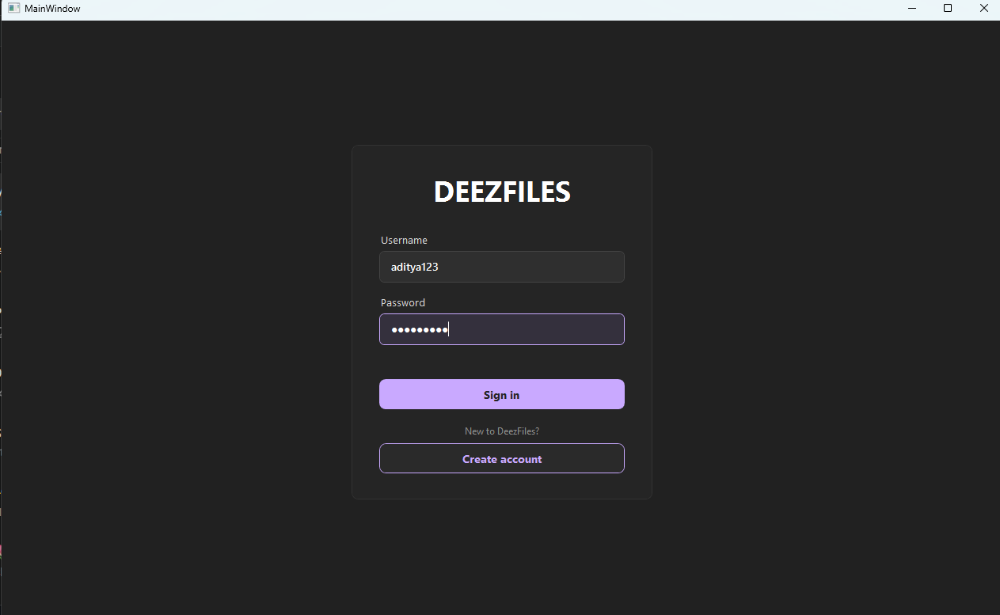
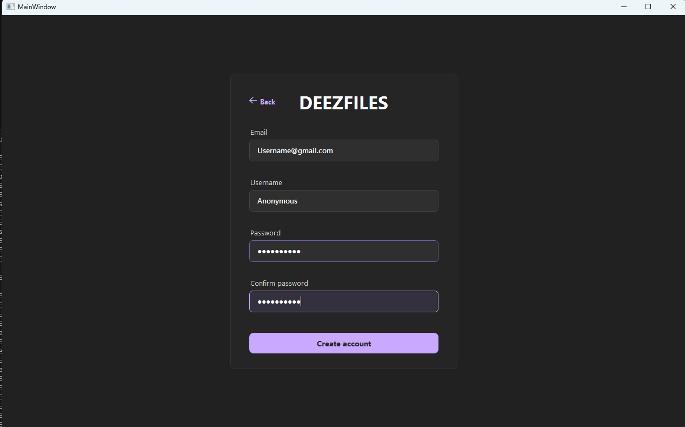
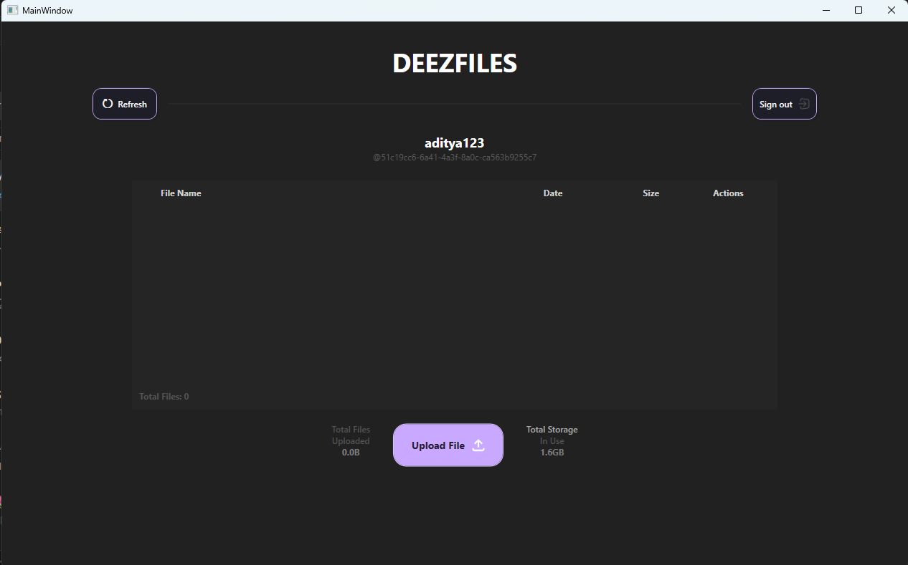
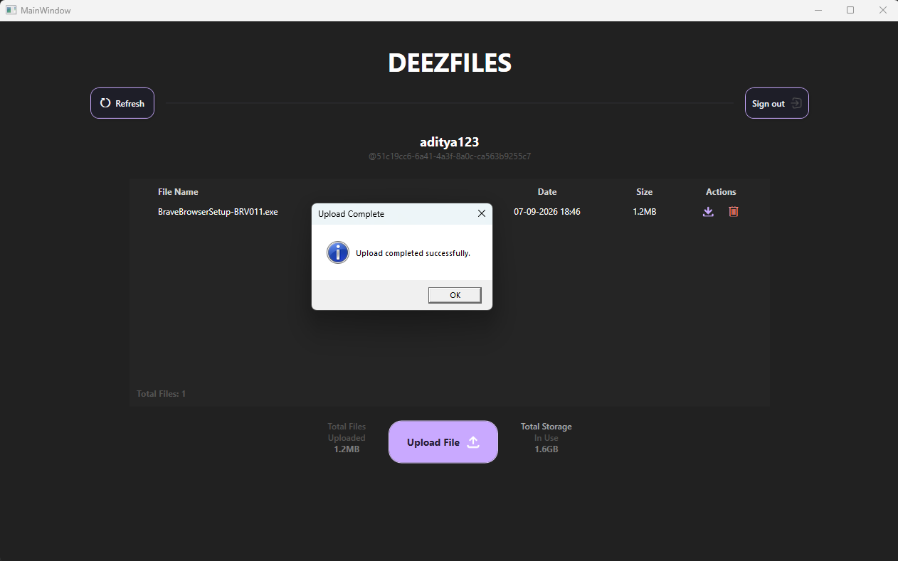
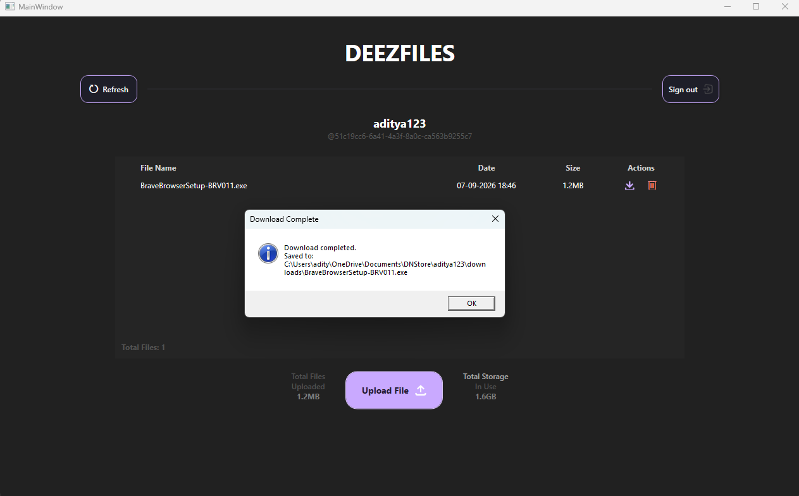

# 🚀 Blockchain-Based Decentralized Storage Network

A **Blockchain-based Decentralized File Storage System** developed as a Final Year B.E. Computer Engineering Project.


This project combines **Blockchain**, **AES-256 Encryption**, **Peer-to-Peer Networking**, and **Cloud Backup** to provide a secure, decentralized alternative to traditional cloud storage.

---

## 📌 Features

✔ Secure User Registration & Login

✔ AES-256 File Encryption

✔ Password-derived Encryption Keys (PBKDF2)

✔ File Chunking

✔ Distributed Storage Across Nodes

✔ Blockchain-based Storage Transactions

✔ Merkle Tree Verification

✔ Peer-to-Peer File Sharing

✔ UDP Hole Punching

✔ Azure Relay Backup

✔ Automatic File Manifest Synchronization

✔ Multi-device File Access

✔ Download & Reconstruction of Encrypted Files

---

# 🏗 System Architecture

```
                User
                  │
                  ▼
          WPF Desktop Client
                  │
        AES-256 Encryption
                  │
          File Chunk Creation
                  │
      Blockchain Transaction
                  │
     ┌────────────┴────────────┐
     │                         │
Peer Storage Nodes      Azure Relay
     │                         │
     └────────────┬────────────┘
                  │
          File Reconstruction
                  │
             Download File
```

---

# 🖼️ Application Screenshots

## Login Page



---

## Registration



---

## Upload Dashboard



---

## Upload File



---

## Download File



---

# ⚙ Technologies Used

| Technology | Purpose |
|------------|---------|
| C# | Application Development |
| WPF | Desktop Interface |
| ASP.NET Core | Backend API |
| Azure App Service | Hosting Backend |
| Azure SQL | User Database |
| Blockchain | Storage Verification |
| UDP | Peer-to-Peer Communication |
| AES-256 | File Encryption |
| PBKDF2 | Key Derivation |
| SHA-256 | File & Block Hashing |
| JSON | Metadata Storage |

---

# 📂 Project Structure

```
Blockchain-Decentralized-Storage-Network
│
├── DNStore
│   ├── Models
│   ├── Services
│   ├── Utilities
│   ├── Views
│
├── DNStoreBackend
│   ├── Controllers
│   ├── Models
│   ├── Migrations
│
├── screenshots
│
└── README.md
```

---

# 🔐 Security Features

- AES-256 Encryption
- SHA-256 File Hashing
- Password-derived Keys using PBKDF2
- Blockchain Transaction Validation
- Merkle Tree Verification
- Node Authentication
- Encrypted File Storage

---

# 🔄 Workflow

1. User logs into the application.
2. File is encrypted using AES-256.
3. File is divided into chunks.
4. Each chunk is hashed.
5. Blockchain transaction is created.
6. Chunks are distributed across storage nodes.
7. Metadata is stored securely.
8. During download, shards are collected.
9. Chunks are decrypted.
10. Original file is reconstructed.

---

# 🚀 Installation

Clone the repository

```bash
git clone https://github.com/0-Anonymous/Blockchain-Decentralized-Storage-Network.git
```

Open

```
DNStore.sln
```

Run the Backend.

Run the WPF Application.

---

# 📖 Future Improvements

- Smart Contracts
- IPFS Integration
- Proof-of-Stake Consensus
- Mobile Application
- Web Dashboard
- End-to-End Node Reputation System
- File Versioning

---

# 👨‍💻 Author

**Aditya**

Bachelor of Engineering (Computer Engineering)

---

# ⭐ Support

If you found this project useful, consider giving it a ⭐ on GitHub.
